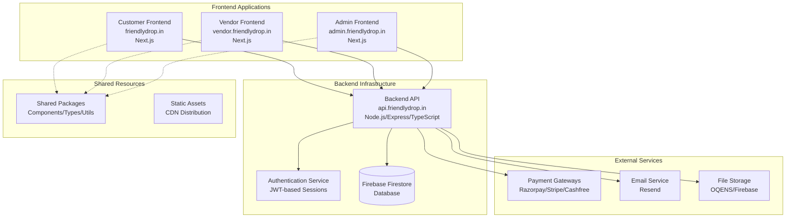

# FriendlyDrop V2 Migration - Technical Design

## Overview

This design document outlines the comprehensive technical architecture for migrating FriendlyDrop from a monolithic Next.js application to an enterprise microservices architecture. The migration will decompose the existing single application into four independent deployment units while preserving 100% functionality and maintaining enterprise-grade security, performance, and scalability.

### Architecture Goals

- **Complete Domain Separation**: Transform monolithic architecture into four independent applications
- **Zero Functionality Regression**: Preserve all existing features, UI/UX, and business logic
- **Enterprise Security**: Implement centralized authentication with JWT-based session management
- **Independent Deployability**: Enable separate development, testing, and deployment cycles
- **Scalability**: Support horizontal scaling of individual applications
- **Performance Optimization**: Maintain or improve current performance metrics

## Architecture

### Current State Analysis

The existing monolithic application combines:
- Customer frontend (Next.js pages + API routes)
- Vendor dashboard (Next.js pages + API routes) 
- Admin dashboard (Next.js pages + API routes)
- Shared UI components and business logic
- Firebase Firestore database with admin SDK
- Firebase Authentication (client-side)
- Payment integrations (Razorpay, Stripe, Cashfree)
- File upload systems
- Email/notification systems

### Target Architecture



### Application Boundaries

#### 1. Backend API (api.friendlydrop.in)
- **Purpose**: Centralized REST API server handling all business logic
- **Technology**: Node.js + Express + TypeScript + Prisma
- **Responsibilities**:
  - All database operations via Prisma ORM
  - Authentication and authorization
  - Payment processing and webhook handling
  - File upload management
  - Email and notification systems
  - Business logic enforcement
  - Data validation and sanitization

#### 2. Customer Frontend (friendlydrop.in)
- **Purpose**: Customer-facing e-commerce website
- **Technology**: Next.js + TypeScript + Tailwind CSS
- **Responsibilities**:
  - Product browsing and search
  - Shopping cart and wishlist
  - Checkout and payment flow
  - Order management and tracking
  - User account management
  - Customer support interface

#### 3. Vendor Frontend (vendor.friendlydrop.in)
- **Purpose**: Vendor dashboard for business management
- **Technology**: Next.js + TypeScript + Tailwind CSS
- **Responsibilities**:
  - Product management (CRUD operations)
  - Order management and fulfillment
  - Inventory tracking
  - Customer management
  - Analytics and reporting
  - Vendor settings and profile

#### 4. Admin Frontend (admin.friendlydrop.in)
- **Purpose**: Platform administration and management
- **Technology**: Next.js + TypeScript + Tailwind CSS
- **Responsibilities**:
  - Platform oversight and monitoring
  - User and vendor management
  - Order and payment oversight
  - Content and catalog management
  - System settings and configuration
  - Analytics and reporting

## Components and Interfaces

### Shared Package Architecture

```mermaid
graph LR
    subgraph "Shared Packages"
        UI[UI Components<br/>@friendlydrop/ui]
        TYPES[Type Definitions<br/>@friendlydrop/types]
        UTILS[Utilities<br/>@friendlydrop/utils]
        CONFIG[Configurations<br/>@friendlydrop/config]
    end
    
    subgraph "Frontend Applications"
        CF2[Customer Frontend]
        VF2[Vendor Frontend] 
        AF2[Admin Frontend]
    end
    
    UI --> CF2
    UI --> VF2
    UI --> AF2
    
    TYPES --> CF2
    TYPES --> VF2
    TYPES --> AF2
    
    UTILS --> CF2
    UTILS --> VF2
    UTILS --> AF2
    
    CONFIG --> CF2
    CONFIG --> VF2
    CONFIG --> AF2
```

#### @friendlydrop/ui Package
- **Purpose**: Shared UI components across all frontends
- **Contents**:
  - Base shadcn/ui components (Button, Card, Input, etc.)
  - Custom business components (ProductCard, OrderStatus, etc.)
  - Layout components (Header, Footer, Sidebar patterns)
  - Form components with validation
  - Loading states and error boundaries

#### @friendlydrop/types Package
- **Purpose**: Consistent TypeScript types across all applications
- **Contents**:
  - API request/response interfaces
  - Database entity types
  - Authentication and authorization types
  - Business domain types (Product, Order, User, etc.)
  - Configuration and settings types

#### @friendlydrop/utils Package
- **Purpose**: Shared utility functions
- **Contents**:
  - Date/time formatting utilities
  - Currency and number formatting
  - Validation helpers
  - URL and slug generation
  - Image optimization utilities
  - Error handling utilities

#### @friendlydrop/config Package
- **Purpose**: Shared configuration and constants
- **Contents**:
  - ESLint and Prettier configurations
  - Tailwind CSS configurations
  - TypeScript configurations
  - Build and deployment configurations
  - Environment variable schemas

### API Interface Design

#### Authentication Endpoints
```typescript
// Authentication API Interface
interface AuthAPI {
  // User authentication
  POST /api/auth/login: {
    body: { email: string; password: string };
    response: { token: string; user: UserProfile };
  };
  
  POST /api/auth/signup: {
    body: { email: string; password: string; name: string; role?: UserRole };
    response: { token: string; user: UserProfile };
  };
  
  POST /api/auth/logout: {
    headers: { Authorization: string };
    response: { success: boolean };
  };
  
  GET /api/auth/me: {
    headers: { Authorization: string };
    response: { user: UserProfile };
  };
  
  POST /api/auth/refresh: {
    body: { refreshToken: string };
    response: { token: string; refreshToken: string };
  };
}
```

#### Product Management Endpoints
```typescript
// Product API Interface
interface ProductAPI {
  // Public product endpoints
  GET /api/products: {
    query: { page?: number; limit?: number; category?: string; search?: string };
    response: { products: Product[]; pagination: PaginationMeta };
  };
  
  GET /api/products/:id: {
    response: { product: Product };
  };
  
  // Vendor-specific product endpoints (requires vendor auth)
  POST /api/vendor/products: {
    headers: { Authorization: string };
    body: Omit<Product, 'id' | 'createdAt' | 'updatedAt'>;
    response: { product: Product };
  };
  
  PUT /api/vendor/products/:id: {
    headers: { Authorization: string };
    body: Partial<Product>;
    response: { product: Product };
  };
  
  DELETE /api/vendor/products/:id: {
    headers: { Authorization: string };
    response: { success: boolean };
  };
}
```

#### Order Management Endpoints
```typescript
// Order API Interface  
interface OrderAPI {
  // Customer order endpoints
  GET /api/orders: {
    headers: { Authorization: string };
    query: { status?: OrderStatus; page?: number };
    response: { orders: Order[]; pagination: PaginationMeta };
  };
  
  POST /api/orders: {
    headers: { Authorization: string };
    body: {
      items: CartItem[];
      address: Address;
      paymentMethod: PaymentProvider;
      couponCode?: string;
    };
    response: { order: Order; paymentDetails: PaymentRecord };
  };
  
  // Vendor order endpoints
  GET /api/vendor/orders: {
    headers: { Authorization: string };
    query: { status?: OrderStatus; page?: number };
    response: { orders: Order[]; pagination: PaginationMeta };
  };
  
  PATCH /api/vendor/orders/:id/status: {
    headers: { Authorization: string };
    body: { status: OrderStatus; note?: string };
    response: { order: Order };
  };
}
```

### Component Migration Strategy

#### UI Component Extraction Process
1. **Audit Phase**: Identify all shared components across current application
2. **Classification Phase**: Categorize components by usage patterns
3. **Extraction Phase**: Move shared components to @friendlydrop/ui package
4. **Optimization Phase**: Optimize components for reusability
5. **Integration Phase**: Update all applications to use shared package

#### Component Categories
```typescript
// Component classification for shared package
interface ComponentCategories {
  // Base UI components (from shadcn/ui)
  base: [
    'Button', 'Input', 'Card', 'Badge', 'Dialog', 'DropdownMenu',
    'Select', 'Tabs', 'Table', 'Sheet', 'Tooltip', 'ScrollArea'
  ];
  
  // Business-specific components
  business: [
    'ProductCard', 'OrderStatus', 'UserAvatar', 'PriceDisplay',
    'AddToCartButton', 'PaymentMethodSelector', 'OrderTimeline'
  ];
  
  // Layout components  
  layout: [
    'AppShell', 'Sidebar', 'Topbar', 'Footer', 'BreadcrumbNav',
    'MobileBottomNav', 'EmptyState', 'LoadingSpinner'
  ];
  
  // Form components
  forms: [
    'FormField', 'FormError', 'FormSubmit', 'AddressForm',
    'PaymentForm', 'ProductForm', 'UserForm'
  ];
}
```

## Data Models

### Database Migration Strategy

The migration will preserve the existing Firebase Firestore database structure while introducing Prisma ORM for type-safe database operations in the Backend API.

#### Current Database Schema Preservation
```typescript
// Existing Firebase collections - PRESERVED
interface FirestoreCollections {
  users: UserProfile[];
  products: Product[];
  orders: Order[];
  vendors: VendorProfile[];
  transactions: Transaction[];
  categories: CatalogCategory[];
  coupons: Coupon[];
  reviews: Review[];
  uploads: UploadRecord[];
  support_tickets: SupportTicket[];
  settings: StoreSettings[];
  banners: BannerItem[];
  // ... all existing collections preserved
}
```

#### Prisma Schema Configuration
```prisma
// prisma/schema.prisma
generator client {
  provider = "prisma-client-js"
}

datasource db {
  provider = "firebase"
  url      = env("DATABASE_URL")
}

// User management
model User {
  id        String   @id @default(auto()) @map("_id") @db.ObjectId
  email     String   @unique
  name      String
  role      UserRole @default(USER)
  status    UserStatus @default(ACTIVE)
  profile   Json?
  createdAt DateTime @default(now())
  updatedAt DateTime @updatedAt
  
  // Relations
  orders    Order[]
  reviews   Review[]
  uploads   Upload[]
  
  @@map("users")
}

// Product management
model Product {
  id          String   @id @default(auto()) @map("_id") @db.ObjectId
  name        String
  slug        String   @unique
  description String
  price       Float
  stock       Int
  category    String
  vendorId    String?  @db.ObjectId
  status      ProductStatus @default(DRAFT)
  images      Json
  attributes  Json?
  createdAt   DateTime @default(now())
  updatedAt   DateTime @updatedAt
  
  // Relations
  vendor      User?    @relation(fields: [vendorId], references: [id])
  orderItems  OrderItem[]
  reviews     Review[]
  
  @@map("products")
}

// Order management
model Order {
  id            String   @id @default(auto()) @map("_id") @db.ObjectId
  userId        String   @db.ObjectId
  totalAmount   Float
  status        OrderStatus @default(PENDING)
  address       Json
  payment       Json
  timeline      Json[]
  createdAt     DateTime @default(now())
  updatedAt     DateTime @updatedAt
  
  // Relations
  user          User     @relation(fields: [userId], references: [id])
  items         OrderItem[]
  transactions  Transaction[]
  
  @@map("orders")
}

model OrderItem {
  id        String  @id @default(auto()) @map("_id") @db.ObjectId
  orderId   String  @db.ObjectId
  productId String  @db.ObjectId
  quantity  Int
  unitPrice Float
  
  // Relations
  order     Order   @relation(fields: [orderId], references: [id])
  product   Product @relation(fields: [productId], references: [id])
  
  @@map("order_items")
}
```

### API Data Transfer Objects

#### Request/Response DTOs
```typescript
// API Request DTOs
export interface CreateProductRequest {
  name: string;
  description: string;
  price: number;
  category: string;
  stock: number;
  images: string[];
  attributes?: Record<string, unknown>;
}

export interface UpdateOrderStatusRequest {
  status: OrderStatus;
  note?: string;
}

export interface CreateOrderRequest {
  items: {
    productId: string;
    quantity: number;
    variantId?: string;
  }[];
  address: Address;
  paymentMethod: PaymentProvider;
  couponCode?: string;
}

// API Response DTOs
export interface ApiResponse<T = unknown> {
  success: boolean;
  data?: T;
  error?: {
    code: string;
    message: string;
    details?: Record<string, unknown>;
  };
  pagination?: {
    page: number;
    limit: number;
    total: number;
    totalPages: number;
  };
}

export interface AuthResponse {
  token: string;
  refreshToken: string;
  user: UserProfile;
  expiresAt: number;
}
```

### Data Validation Schemas

```typescript
// Using Zod for runtime validation
import { z } from 'zod';

export const createProductSchema = z.object({
  name: z.string().min(1).max(255),
  description: z.string().min(10),
  price: z.number().positive(),
  category: z.string(),
  stock: z.number().int().min(0),
  images: z.array(z.string().url()).min(1),
  attributes: z.record(z.unknown()).optional(),
});

export const updateOrderStatusSchema = z.object({
  status: z.enum(['pending', 'confirmed', 'packed', 'shipped', 'delivered', 'cancelled']),
  note: z.string().optional(),
});

export const authLoginSchema = z.object({
  email: z.string().email(),
  password: z.string().min(8),
});
```

## Error Handling

### Centralized Error Management

#### Backend API Error Handling
```typescript
// Global error handler middleware
interface ApiError extends Error {
  statusCode: number;
  code: string;
  details?: Record<string, unknown>;
}

export class AppError extends Error implements ApiError {
  constructor(
    public statusCode: number,
    public code: string,
    message: string,
    public details?: Record<string, unknown>
  ) {
    super(message);
    this.name = 'AppError';
  }
}

// Error handling middleware
export function errorHandler(
  error: Error,
  req: Request,
  res: Response,
  next: NextFunction
) {
  if (error instanceof AppError) {
    return res.status(error.statusCode).json({
      success: false,
      error: {
        code: error.code,
        message: error.message,
        details: error.details,
      },
    });
  }
  
  // Log unexpected errors
  console.error('Unexpected error:', error);
  
  return res.status(500).json({
    success: false,
    error: {
      code: 'INTERNAL_SERVER_ERROR',
      message: 'An unexpected error occurred',
    },
  });
}

// Pre-defined error types
export const ErrorCodes = {
  // Authentication errors
  UNAUTHORIZED: { status: 401, code: 'UNAUTHORIZED' },
  FORBIDDEN: { status: 403, code: 'FORBIDDEN' },
  TOKEN_EXPIRED: { status: 401, code: 'TOKEN_EXPIRED' },
  
  // Validation errors
  VALIDATION_ERROR: { status: 400, code: 'VALIDATION_ERROR' },
  INVALID_INPUT: { status: 400, code: 'INVALID_INPUT' },
  
  // Business logic errors
  PRODUCT_NOT_FOUND: { status: 404, code: 'PRODUCT_NOT_FOUND' },
  INSUFFICIENT_STOCK: { status: 400, code: 'INSUFFICIENT_STOCK' },
  ORDER_NOT_FOUND: { status: 404, code: 'ORDER_NOT_FOUND' },
  PAYMENT_FAILED: { status: 400, code: 'PAYMENT_FAILED' },
  
  // System errors
  DATABASE_ERROR: { status: 500, code: 'DATABASE_ERROR' },
  EXTERNAL_SERVICE_ERROR: { status: 503, code: 'EXTERNAL_SERVICE_ERROR' },
} as const;
```

#### Frontend Error Handling
```typescript
// API client with error handling
export class ApiClient {
  private baseUrl: string;
  private token?: string;
  
  constructor(baseUrl: string) {
    this.baseUrl = baseUrl;
  }
  
  setToken(token: string) {
    this.token = token;
  }
  
  async request<T>(
    endpoint: string,
    options: RequestInit = {}
  ): Promise<ApiResponse<T>> {
    const url = `${this.baseUrl}${endpoint}`;
    const headers = {
      'Content-Type': 'application/json',
      ...options.headers,
    };
    
    if (this.token) {
      headers.Authorization = `Bearer ${this.token}`;
    }
    
    try {
      const response = await fetch(url, {
        ...options,
        headers,
      });
      
      const data = await response.json();
      
      if (!response.ok) {
        throw new ApiError(
          data.error?.code || 'API_ERROR',
          data.error?.message || 'Request failed',
          response.status,
          data.error?.details
        );
      }
      
      return data;
    } catch (error) {
      if (error instanceof ApiError) {
        throw error;
      }
      
      throw new ApiError(
        'NETWORK_ERROR',
        'Network request failed',
        0,
        { originalError: error }
      );
    }
  }
}

export class ApiError extends Error {
  constructor(
    public code: string,
    message: string,
    public statusCode: number,
    public details?: Record<string, unknown>
  ) {
    super(message);
    this.name = 'ApiError';
  }
}

// React error boundary for UI error handling
export class ErrorBoundary extends Component<
  { children: ReactNode },
  { hasError: boolean; error?: Error }
> {
  constructor(props: { children: ReactNode }) {
    super(props);
    this.state = { hasError: false };
  }
  
  static getDerivedStateFromError(error: Error) {
    return { hasError: true, error };
  }
  
  componentDidCatch(error: Error, errorInfo: ErrorInfo) {
    console.error('Error boundary caught error:', error, errorInfo);
    // Send to error reporting service
  }
  
  render() {
    if (this.state.hasError) {
      return (
        <div className="min-h-screen flex items-center justify-center">
          <div className="text-center">
            <h1 className="text-2xl font-bold text-red-600">
              Something went wrong
            </h1>
            <p className="text-gray-600 mt-2">
              Please refresh the page or contact support if the problem persists.
            </p>
            <button
              onClick={() => window.location.reload()}
              className="mt-4 px-4 py-2 bg-blue-600 text-white rounded"
            >
              Refresh Page
            </button>
          </div>
        </div>
      );
    }
    
    return this.props.children;
  }
}
```

### Error Recovery Strategies

#### Retry Logic for External Services
```typescript
// Retry utility for external API calls
export async function withRetry<T>(
  operation: () => Promise<T>,
  options: {
    maxRetries?: number;
    initialDelay?: number;
    backoffFactor?: number;
    retryIf?: (error: Error) => boolean;
  } = {}
): Promise<T> {
  const {
    maxRetries = 3,
    initialDelay = 1000,
    backoffFactor = 2,
    retryIf = () => true,
  } = options;
  
  let lastError: Error;
  let delay = initialDelay;
  
  for (let attempt = 0; attempt <= maxRetries; attempt++) {
    try {
      return await operation();
    } catch (error) {
      lastError = error as Error;
      
      if (attempt === maxRetries || !retryIf(lastError)) {
        throw lastError;
      }
      
      await new Promise(resolve => setTimeout(resolve, delay));
      delay *= backoffFactor;
    }
  }
  
  throw lastError!;
}

// Usage in payment processing
export async function processPayment(
  paymentData: PaymentRequest
): Promise<PaymentResponse> {
  return withRetry(
    () => paymentGateway.processPayment(paymentData),
    {
      maxRetries: 2,
      initialDelay: 500,
      retryIf: (error) => error.message.includes('TEMPORARY_UNAVAILABLE'),
    }
  );
}
```

## Testing Strategy

### Comprehensive Testing Approach

The migration will implement a dual testing strategy combining unit tests for specific functionality and property-based tests for universal behaviors, ensuring comprehensive coverage while maintaining development velocity.

#### Unit Testing Strategy
```typescript
// Example unit test structure
describe('Product Management API', () => {
  describe('POST /api/vendor/products', () => {
    it('should create product with valid data', async () => {
      const productData = {
        name: 'Test Product',
        description: 'Test Description',
        price: 99.99,
        category: 'test-category',
        stock: 10,
        images: ['https://example.com/image.jpg'],
      };
      
      const response = await request(app)
        .post('/api/vendor/products')
        .set('Authorization', `Bearer ${vendorToken}`)
        .send(productData)
        .expect(201);
        
      expect(response.body.success).toBe(true);
      expect(response.body.data.product).toMatchObject({
        name: productData.name,
        price: productData.price,
        status: 'draft',
      });
    });
    
    it('should reject product with invalid data', async () => {
      const invalidData = {
        name: '', // Invalid: empty name
        price: -10, // Invalid: negative price
      };
      
      const response = await request(app)
        .post('/api/vendor/products')
        .set('Authorization', `Bearer ${vendorToken}`)
        .send(invalidData)
        .expect(400);
        
      expect(response.body.success).toBe(false);
      expect(response.body.error.code).toBe('VALIDATION_ERROR');
    });
  });
});
```

#### Integration Testing
```typescript
// API integration tests
describe('Order Flow Integration', () => {
  let customer: UserProfile;
  let vendor: UserProfile;
  let product: Product;
  
  beforeAll(async () => {
    // Setup test data
    customer = await createTestUser({ role: 'user' });
    vendor = await createTestUser({ role: 'vendor' });
    product = await createTestProduct({ vendorId: vendor.id });
  });
  
  it('should complete full order flow', async () => {
    // 1. Add to cart
    const cartResponse = await apiClient.post('/api/cart', {
      productId: product.id,
      quantity: 2,
    });
    
    // 2. Create order
    const orderResponse = await apiClient.post('/api/orders', {
      items: [{ productId: product.id, quantity: 2 }],
      address: testAddress,
      paymentMethod: 'stripe',
    });
    
    // 3. Process payment
    const paymentResponse = await apiClient.post('/api/payments/stripe/confirm', {
      orderId: orderResponse.data.order.id,
      paymentIntentId: 'pi_test_12345',
    });
    
    // Verify order status progression
    expect(orderResponse.data.order.status).toBe('pending');
    expect(paymentResponse.data.order.status).toBe('confirmed');
  });
});
```

#### End-to-End Testing
```typescript
// E2E testing with Playwright
import { test, expect } from '@playwright/test';

test.describe('Customer Journey', () => {
  test('complete purchase flow', async ({ page }) => {
    // Navigate to product page
    await page.goto('/products/test-product');
    
    // Add to cart
    await page.click('[data-testid="add-to-cart"]');
    await expect(page.locator('[data-testid="cart-count"]')).toContainText('1');
    
    // Go to checkout
    await page.click('[data-testid="cart-button"]');
    await page.click('[data-testid="checkout-button"]');
    
    // Fill shipping information
    await page.fill('[data-testid="shipping-name"]', 'Test Customer');
    await page.fill('[data-testid="shipping-address"]', '123 Test St');
    
    // Select payment method
    await page.click('[data-testid="payment-stripe"]');
    
    // Complete order
    await page.click('[data-testid="place-order"]');
    
    // Verify success
    await expect(page.locator('[data-testid="order-success"]')).toBeVisible();
  });
});
```

### Testing Configuration

#### Jest Configuration
```javascript
// jest.config.js
module.exports = {
  preset: 'ts-jest',
  testEnvironment: 'node',
  roots: ['<rootDir>/src', '<rootDir>/tests'],
  testMatch: [
    '**/__tests__/**/*.ts',
    '**/?(*.)+(spec|test).ts'
  ],
  collectCoverageFrom: [
    'src/**/*.ts',
    '!src/**/*.d.ts',
    '!src/types/**/*',
  ],
  coverageThreshold: {
    global: {
      branches: 80,
      functions: 80,
      lines: 80,
      statements: 80,
    },
  },
  setupFilesAfterEnv: ['<rootDir>/tests/setup.ts'],
};
```

#### Test Database Setup
```typescript
// Test database configuration
export async function setupTestDatabase() {
  const testDb = await createTestFirestoreInstance();
  
  // Seed test data
  await seedTestUsers();
  await seedTestProducts(); 
  await seedTestOrders();
  
  return testDb;
}

export async function teardownTestDatabase() {
  await clearAllCollections();
}

// Test data factories
export function createTestProduct(overrides: Partial<Product> = {}): Product {
  return {
    id: generateTestId(),
    name: 'Test Product',
    slug: 'test-product',
    description: 'Test product description',
    price: 99.99,
    stock: 10,
    category: 'test-category',
    images: ['https://example.com/test-image.jpg'],
    status: 'published',
    createdAt: new Date().toISOString(),
    ...overrides,
  };
}
```

## Correctness Properties

*A property is a characteristic or behavior that should hold true across all valid executions of a system-essentially, a formal statement about what the system should do. Properties serve as the bridge between human-readable specifications and machine-verifiable correctness guarantees.*

### Property Reflection

After analyzing all acceptance criteria, several properties can be consolidated to eliminate redundancy and provide comprehensive validation:

- Properties related to domain separation and access control can be combined into comprehensive authorization properties
- API contract preservation properties can be unified into endpoint compatibility verification
- Authentication and authorization properties can be consolidated into security enforcement verification
- Database and business logic preservation can be combined into behavioral consistency properties

### Property 1: Domain Separation Enforcement

*For any* user session with a specific role (customer/vendor/admin) and any API endpoint or UI component, the system SHALL enforce strict domain boundaries preventing cross-role access to unauthorized functionality or data

**Validates: Requirements 1.6, 3.5**

### Property 2: Independent Deployment Isolation  

*For any* single application deployment operation, the functionality and availability of all other applications SHALL remain completely unaffected and operational

**Validates: Requirements 1.7**

### Property 3: UI Component Rendering Preservation

*For any* React component and any valid set of props, the rendered output SHALL be identical between the monolithic and microservices implementations

**Validates: Requirements 2.2**

### Property 4: API Contract Compatibility

*For any* existing API endpoint and any valid request payload, the response structure, data types, and business logic outcomes SHALL be identical between the monolithic and microservices implementations

**Validates: Requirements 2.3, 3.3**

### Property 5: Authentication Flow Consistency

*For any* user role (customer/vendor/admin) and any authentication operation (login/logout/session management), the authentication flow and JWT token behavior SHALL work identically across all applications

**Validates: Requirements 2.4, 3.4**

### Property 6: Business Logic Preservation

*For any* business operation (order processing, payment handling, inventory management) and any valid input data, the business logic execution and outcomes SHALL produce identical results between systems

**Validates: Requirements 2.5, 2.7, 2.8, 2.9, 2.10**

### Property 7: Database Operation Consistency

*For any* database operation (create, read, update, delete) and any valid data payload, the operation results, constraints enforcement, and data integrity SHALL be preserved identically between systems

**Validates: Requirements 2.6, 3.10**

### Property 8: Security Feature Enforcement

*For any* request pattern and security scenario (rate limiting, input validation, authorization checks), the security measures SHALL be enforced consistently and correctly across all applications

**Validates: Requirements 3.6, 3.7**

### Property 9: Error Handling Consistency

*For any* error condition or exception scenario, the error handling, response format, and logging behavior SHALL be consistent and predictable across all applications

**Validates: Requirements 3.8**

### Property 10: Caching Behavior Reliability

*For any* cacheable request and cache invalidation scenario, the caching behavior SHALL maintain data consistency and performance optimization across all applications

**Validates: Requirements 3.9**

## Testing Strategy

### Comprehensive Testing Framework

The migration requires a sophisticated testing strategy that combines multiple testing approaches to ensure zero regression while validating the new architecture's correctness and performance.

#### Property-Based Testing Implementation

**Framework Selection**: Fast-check for TypeScript/JavaScript property-based testing
**Test Configuration**: Minimum 100 iterations per property test
**Test Environment**: Isolated test instances of both monolithic and microservices systems

**Property Test Example**:
```typescript
// Property Test: API Contract Compatibility
import fc from 'fast-check';

describe('API Contract Compatibility', () => {
  it('preserves response contracts across all endpoints', async () => {
    await fc.assert(
      fc.asyncProperty(
        fc.constantFrom(...API_ENDPOINTS),
        fc.record({
          headers: fc.record({ authorization: fc.string() }),
          body: fc.object(),
          query: fc.record({ [fc.string()]: fc.string() }),
        }),
        async (endpoint, request) => {
          // Test against both systems
          const legacyResponse = await legacyAPI.request(endpoint, request);
          const newResponse = await newAPI.request(endpoint, request);
          
          // Verify identical structure and business logic
          expect(newResponse).toMatchSchema(legacyResponse.schema);
          expect(newResponse.data).toEqual(legacyResponse.data);
        }
      ),
      { numRuns: 100 }
    );
  });
});

// **Feature: friendlydrop-v2-migration, Property 4: For any existing API endpoint and any valid request payload, the response structure, data types, and business logic outcomes SHALL be identical between the monolithic and microservices implementations**
```

#### Unit Testing Strategy

**Framework**: Jest with TypeScript support
**Coverage Requirements**: 
- Backend API: 90% code coverage
- Frontend Applications: 85% code coverage
- Shared Packages: 95% code coverage

**Testing Categories**:
1. **Component Testing**: All React components with props validation
2. **API Endpoint Testing**: All REST endpoints with request/response validation  
3. **Business Logic Testing**: Core business functions with edge cases
4. **Database Operation Testing**: CRUD operations and constraint validation
5. **Authentication Testing**: JWT handling and session management

#### Integration Testing

**Approach**: Full-stack integration testing across application boundaries
**Test Scenarios**:
- Cross-application authentication flow
- Order processing workflow from customer to vendor to admin
- Payment processing integration with all providers
- File upload and storage operations
- Email and notification delivery

**Example Integration Test**:
```typescript
describe('Order Processing Integration', () => {
  it('processes complete order workflow across all applications', async () => {
    // Customer creates order via Customer Frontend
    const order = await customerAPI.createOrder(testOrderData);
    
    // Vendor receives and processes order via Vendor Frontend  
    const vendorOrder = await vendorAPI.getOrder(order.id);
    await vendorAPI.updateOrderStatus(order.id, 'confirmed');
    
    // Admin monitors order via Admin Frontend
    const adminOrder = await adminAPI.getOrder(order.id);
    expect(adminOrder.status).toBe('confirmed');
    
    // Verify all applications show consistent data
    const customerOrder = await customerAPI.getOrder(order.id);
    expect(customerOrder.status).toBe('confirmed');
  });
});
```

#### End-to-End Testing

**Framework**: Playwright for cross-browser testing
**Test Coverage**: Critical user journeys across all applications

**E2E Test Scenarios**:
```typescript
test.describe('Complete Customer Journey', () => {
  test('customer can browse, purchase, and track order', async ({ page }) => {
    // Browse products on Customer Frontend
    await page.goto('https://friendlydrop.in');
    await page.click('[data-testid="product-card"]');
    
    // Add to cart and checkout
    await page.click('[data-testid="add-to-cart"]');
    await page.goto('/checkout');
    
    // Complete purchase with payment
    await fillCheckoutForm(page);
    await processPayment(page);
    
    // Verify order confirmation
    await expect(page.locator('[data-testid="order-success"]')).toBeVisible();
    
    // Track order status
    const orderId = await page.getAttribute('[data-testid="order-id"]', 'value');
    await page.goto(`/orders/${orderId}`);
    await expect(page.locator('[data-testid="order-status"]')).toContainText('confirmed');
  });
});
```

#### Performance Testing

**Load Testing**: Verify each application handles expected traffic
**Stress Testing**: Test system behavior under peak conditions
**Baseline Comparison**: Ensure migration doesn't degrade performance

**Performance Benchmarks**:
- API Response Time: ≤ current monolithic performance
- Page Load Time: ≤ current page load speeds
- Database Query Performance: ≤ current query response times
- File Upload Performance: ≤ current upload speeds

#### Migration Validation Testing

**Parallel Testing**: Run both systems simultaneously during migration
**Data Consistency Verification**: Ensure database state remains consistent
**Feature Flag Testing**: Validate gradual feature migration approach

### Testing Infrastructure

#### Test Data Management
```typescript
// Test data factory for consistent test scenarios
export class TestDataFactory {
  static createTestUser(role: UserRole = 'user'): UserProfile {
    return {
      id: generateTestId(),
      email: `test-${Date.now()}@example.com`,
      name: 'Test User',
      role,
      status: 'active',
      createdAt: new Date().toISOString(),
    };
  }
  
  static createTestProduct(vendorId?: string): Product {
    return {
      id: generateTestId(),
      name: `Test Product ${Date.now()}`,
      slug: `test-product-${Date.now()}`,
      description: 'Test product description',
      price: Math.floor(Math.random() * 1000) + 10,
      stock: Math.floor(Math.random() * 100) + 1,
      category: 'test-category',
      images: ['https://example.com/test-image.jpg'],
      status: 'published',
      vendorId,
      createdAt: new Date().toISOString(),
    };
  }
  
  static createTestOrder(userId: string, items: CartItem[]): Omit<Order, 'id' | 'createdAt'> {
    return {
      userId,
      items,
      totalAmount: items.reduce((sum, item) => sum + (item.price * item.quantity), 0),
      status: 'pending',
      address: this.createTestAddress(),
      payment: this.createTestPayment(),
      timeline: [],
      updatedAt: new Date().toISOString(),
    };
  }
}
```

#### Continuous Testing Pipeline
```yaml
# GitHub Actions workflow for continuous testing
name: Migration Testing Pipeline
on: [push, pull_request]

jobs:
  unit-tests:
    runs-on: ubuntu-latest
    steps:
      - uses: actions/checkout@v3
      - uses: actions/setup-node@v3
        with:
          node-version: '18'
      - run: npm ci
      - run: npm run test:unit
      - run: npm run test:coverage
      
  integration-tests:
    runs-on: ubuntu-latest
    needs: unit-tests
    steps:
      - uses: actions/checkout@v3
      - run: docker-compose up -d test-db
      - run: npm run test:integration
      
  property-tests:
    runs-on: ubuntu-latest
    needs: unit-tests
    steps:
      - uses: actions/checkout@v3
      - run: npm run test:property
      - run: npm run test:property:regression
      
  e2e-tests:
    runs-on: ubuntu-latest
    needs: [unit-tests, integration-tests]
    steps:
      - uses: actions/checkout@v3
      - run: npm run build:all
      - run: docker-compose up -d
      - run: npx playwright test
```

This comprehensive design document provides the complete technical blueprint for migrating FriendlyDrop to a microservices architecture. The design ensures zero functionality regression through rigorous property-based testing while establishing enterprise-grade architecture patterns for scalability and maintainability.